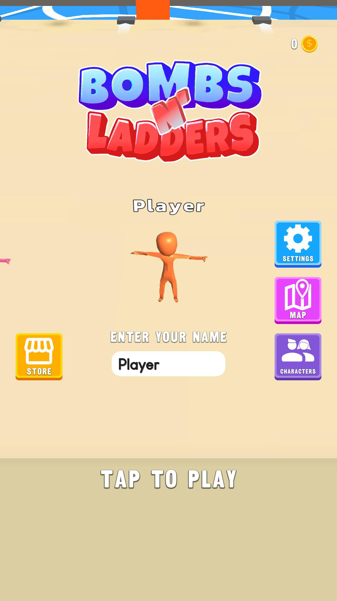
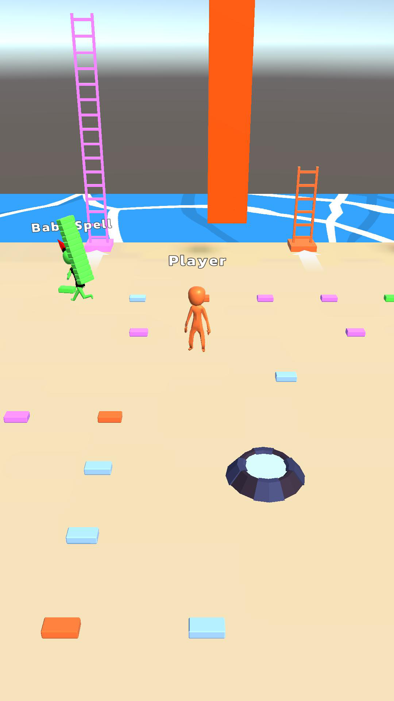
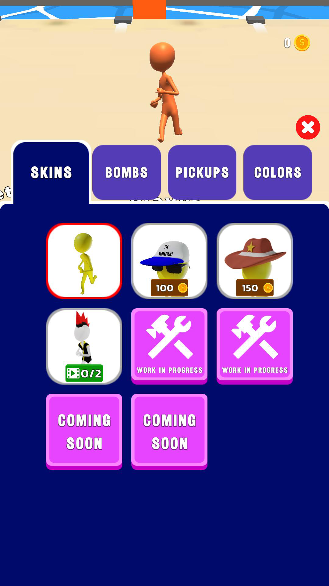

# Hyper-Casual Game Template (Unity)

This is a complete and functional hyper-casual game template built with Unity 6.  
It includes a working AI opponent, a customization system, and a save system — everything needed to kickstart a mobile hyper-casual game.

---

## 🎮 Features

- ✅ **AI Opponent**  
  Fully implemented enemy AI logic for engaging gameplay.

- 🎨 **Customization System**  
  Players can switch between:

  - Multiple **player skins**
  - Different **pickup item skins**
  - Unique **bomb skins**

- 💾 **Save System**  
  All player preferences and unlocks are saved and loaded automatically.

- 📱 **Mobile-Ready**  
  Built with mobile platforms in mind. Easy to build for Android or iOS.

---

## 📦 Built With

- **Unity 6**
- [MyBox](https://github.com/Deadcows/MyBox) – a collection of useful attributes and tools that helped simplify development

---

## 📜 License

This project is licensed under the [MIT License](LICENSE).  
You're free to use, modify, or publish games based on this template. Attribution is appreciated but not required.

---

## 🙋‍♂️ About the Developer

Hi, I’m **Ali Osman Baştepe**, an aspiring game developer passionate about building games.  
I made this project to teach myself Unity. It's open for anyone to learn from, improve, or build upon.

- Email: [aliosmanbastepe@gmail.com]
- GitHub: [github.com/Berktu99]
